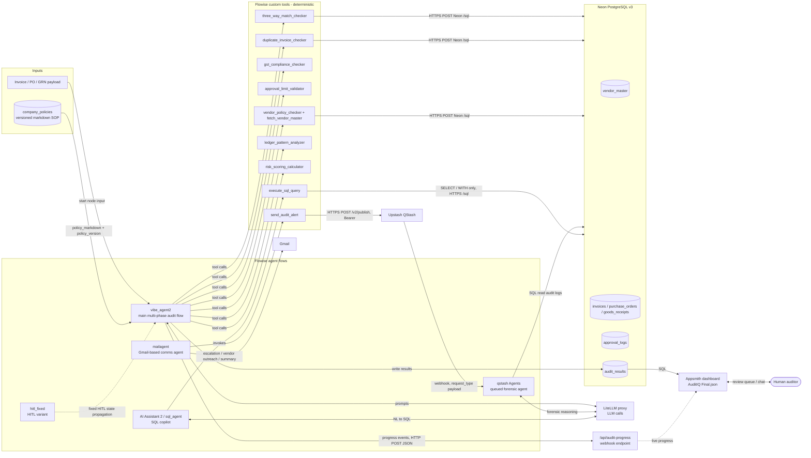
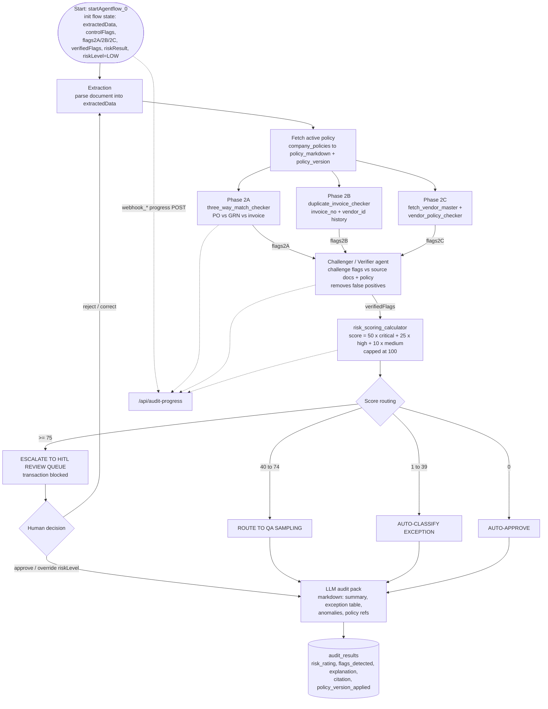
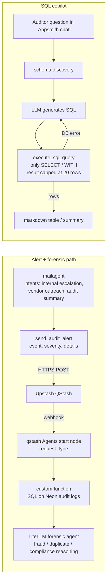
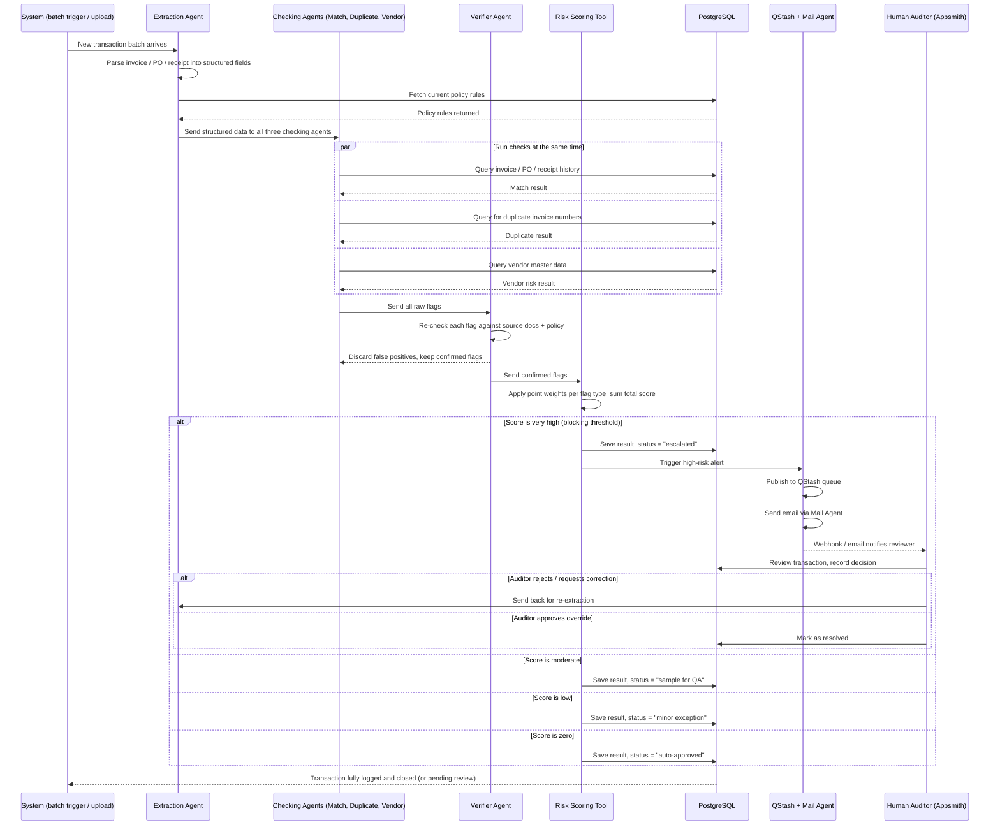
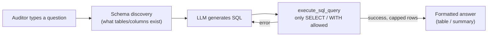

# AuditIQ — Architecture, Flows & Interview Q&A

*(Based on verified DeepWiki documentation for Chandana909/AuditIQ-DeloitteHacksplosion)*

---

## 1. System Architecture

**Overview:** `vibe_agent2` runs on Flowise and calls deterministic custom tools that query Neon Postgres over an HTTPS `/sql` endpoint. It uses an LLM through LiteLLM for reasoning and report writing, and writes results to `audit_results`. The mail agent sends emails and publishes alerts to QStash, which triggers a separate queued forensic agent. A read-only SQL copilot and the Appsmith dashboard sit on top of the same database.

---

## 2. Main Pipeline — Agentic / Control Flow

**Overview:** State is initialised, the document is extracted, and the active policy version is fetched. Parallel deterministic phases (2A three-way match, 2B duplicates, 2C vendor intelligence) each write flags to state. A challenger/verifier layer filters false positives, and a weighted scorer maps the total to one of four routes. High scores block the transaction for human review, and a rejection loops back to extraction and re-analysis. Every path ends in an LLM-written audit pack persisted to `audit_results`, with the policy version recorded for traceability.

---

## 3. Alerting & SQL Copilot Flows

**Overview:** The mail agent's `send_audit_alert` tool publishes alerts to QStash, which triggers a separate queued forensic agent that re-reads audit logs and does deeper reasoning through LiteLLM. Separately, an auditor can ask questions in plain English in the dashboard chat; an LLM turns the question into a read-only SQL query (`SELECT`/`WITH` only, capped at 20 rows), with an automatic retry loop if the query errors.

---

## 4. Interview Q&A

**Non-Technical**

1. **What does AuditIQ do?**
   Automates forensic auditing — checks 100% of transactions (not samples) for fraud, compliance breaks, and procurement risk, then flags high-risk ones for human review.
2. **What problem does it solve?**
   Manual audits only sample a fraction of transactions; AuditIQ checks every transaction against policy, catching more fraud/errors, faster.
3. **Who uses it?**
   Internal auditors — via a dashboard showing flagged transactions with a full evidence trail (ISA 230 "Chain of Evidence").
4. **What's a real example it catches?**
   Duplicate invoice, GST/tax mismatch, invoice amount not matching PO/GRN (three-way match failure), invoice from a policy-violating vendor.
5. **How does it decide what's "risky"?**
   Weighted scoring: 50 points per critical flag, 25 per high, 10 per medium, capped at 100 — then routed to one of four outcomes based on the total.
6. **What happens after a transaction is flagged?**
   High-scoring transactions are blocked and escalated to a human review queue; the mail agent can also send email alerts and publish to QStash for a deeper automated forensic pass.
7. **Why not just use an LLM to "read" every invoice manually?**
   Uses a pipeline of deterministic tools (three-way match, duplicate check, vendor check) plus a verifier layer and a scorer — auditable and consistent, with the LLM used for reasoning/report-writing rather than the actual decision math.

**Technical**

8. **What's the tech stack?**
   Flowise for agent orchestration, Neon PostgreSQL for data, LiteLLM as the model-routing layer, Upstash QStash for background alerts, Gmail for email, Appsmith for the dashboard.
9. **Describe the main pipeline (`vibe_agent2`).**
   Init state → extraction → fetch active policy → three parallel phases (2A three-way match, 2B duplicates, 2C vendor intelligence) → challenger/verifier agent removes false positives → risk scoring → routing → LLM-written audit pack → saved to `audit_results`.
10. **What is `risk_scoring_calculator`?**
    A tool that assigns 50/25/10 points per critical/high/medium flag, sums them, and caps the total at 100.
11. **What are the four routing outcomes?**
    Score ≥75 → escalate to HITL (blocked); 40–74 → QA sampling; 1–39 → auto-classified exception; 0 → auto-approve.
12. **What is "three-way matching"?**
    Automated reconciliation of Invoice vs Purchase Order vs Goods Receipt Note — quantities/amounts must align across all three documents.
13. **What does the challenger/verifier agent do?**
    Re-checks every flag raised by phases 2A/2B/2C against the source documents and policy text, discarding false positives before scoring.
14. **How is policy encoded and used?**
    Stored as versioned markdown in `company_policies`; the pipeline fetches the active `policy_markdown` and `policy_version` at the start of each run and cites the version applied in the final result.
15. **What are the key DB tables?**
    `vendor_master`, `invoices`, `purchase_orders`, `goods_receipts`, `approval_logs`, `audit_results`, `company_policies`.
16. **How does the alerting pipeline work technically?**
    The mail agent's `send_audit_alert` tool POSTs to QStash (`/v2/publish`), which delivers a webhook to a separate queued forensic agent flow that re-reads audit logs from Postgres and reasons over them via LiteLLM.
17. **How does the SQL copilot on the dashboard work?**
    Converts an auditor's natural-language question into SQL via an LLM, but only executes `SELECT`/`WITH` statements (read-only), capped at 20 rows, with an automatic retry if the query errors.
18. **How is HITL (human-in-the-loop) implemented, including the loop-back?**
    Score ≥75 blocks the transaction and routes it to a human queue in Appsmith. If the human rejects/requests correction, the flow loops back to the extraction step for re-analysis rather than just closing the case.
19. **What's the role of the LiteLLM layer?**
    A single routing layer the pipeline and other agents call through for all LLM prompts (reasoning, report writing, NL-to-SQL, forensic analysis) instead of hardcoding one provider.
20. **Why Postgres over a NoSQL store here?**
    Transactional financial data is relational (invoices↔POs↔vendors, foreign keys) and needs SQL joins/analytics views for audit reporting and the read-only SQL copilot.
21. **What's a limitation of the current design?**
    Rule-based/weighted scoring is deterministic but static — doesn't adapt to novel fraud patterns the way a trained ML model could; also relies on the LLM layer being available for report-writing and NL-to-SQL.
22. **What would you improve/scale next?**
    Add retry/idempotency guarantees to the QStash alert pipeline, add ML-based anomaly detection alongside the rule-based scorer, and confirm/extend audit-trail logging beyond `audit_results`.

    ==================================================================================================================================================================================================

    # AuditIQ — Data Flow & Control Flow (Beginner's Guide)

## 1. What is AuditIQ, and why does it exist?

Picture a company's finance department at the end of the month. There are thousands of invoices, purchase orders, and receipts to check. A human auditor normally can only afford to **sample** a small percentage of these — say 5% — and hope the rest are fine. That means fraud, duplicate payments, or policy violations can easily slip through unnoticed.

**AuditIQ** solves this by using a team of specialized AI "workers" (called **agents**) that each check a *different* aspect of every single transaction — automatically, and for 100% of the transactions, not just a sample. Think of it like having a small team of expert auditors, each with one specialty (math-checking, tax rules, vendor history), all working on every transaction at once, and only interrupting a human when something looks genuinely risky.

**Note on assumptions:** This document is based on the documented implementation: a **Flowise**-based multi-agent pipeline (`vibe_agent2`) with custom tools, a **PostgreSQL** database (hosted on Neon), **LiteLLM** as the layer that routes calls to language models, **Upstash QStash** for background job/webhook delivery, **Gmail** for email alerts, and an **Appsmith** dashboard for the human review interface. Anything not explicitly confirmed is marked ⚠.

---

## 2. Data Flow Diagram

This shows **where the data comes from and where it ends up** as it moves through the system.

```mermaid
flowchart LR
    subgraph SOURCE["Source Documents"]
        DOC["Invoice / Purchase Order /\nGoods Receipt Note"]
        POLICY[("Company Policy\nrules document")]
    end

    subgraph AGENTS["Multi-Agent Pipeline (Flowise)"]
        EXTRACT["Extraction Agent\n(reads the document)"]
        MATCH["Three-Way Match Tool\n(Invoice vs PO vs Receipt)"]
        DUP["Duplicate Checker"]
        VENDOR["Vendor Intelligence Tool"]
        VERIFY["Verifier Agent\n(double-checks flags)"]
        SCORE["Risk Scoring Tool"]
        WRITER["Report Writer\n(LLM via LiteLLM)"]
    end

    subgraph DB["PostgreSQL (Neon)"]
        VM[("vendor_master")]
        INV[("invoices / POs / receipts")]
        AR[("audit_results")]
    end

    subgraph ALERT["Alerting"]
        QSTASH["QStash\n(background queue)"]
        MAIL["Mail Agent"]
        WEBHOOK["External Webhook"]
        EMAIL["Email Inbox"]
    end

    subgraph HUMAN["Human Review"]
        DASH["Appsmith Dashboard"]
        AUDITOR(["Human Auditor"])
    end

    DOC -->|"1. new transaction arrives"| EXTRACT
    POLICY -->|"1b. current rules fetched"| EXTRACT
    EXTRACT -->|"2. structured data"| MATCH
    EXTRACT -->|"2. structured data"| DUP
    EXTRACT -->|"2. structured data"| VENDOR

    MATCH -->|"3. reads history"| INV
    DUP -->|"3. reads history"| INV
    VENDOR -->|"3. reads vendor profile"| VM

    MATCH -->|"4. flags found"| VERIFY
    DUP -->|"4. flags found"| VERIFY
    VENDOR -->|"4. flags found"| VERIFY

    VERIFY -->|"5. confirmed flags"| SCORE
    SCORE -->|"6. risk score + level"| WRITER
    WRITER -->|"7. written explanation"| AR

    AR -->|"8. if high risk"| QSTASH
    AR -->|"8. if high risk"| MAIL
    QSTASH --> WEBHOOK
    MAIL --> EMAIL

    AR -->|"9. all results"| DASH
    DASH -->|"10. reviewed by"| AUDITOR
    AUDITOR -->|"11. decision saved back"| AR
```

### Plain-English walkthrough of the data flow

1. A new transaction (an invoice, along with its purchase order and delivery receipt) enters the system, along with the company's current audit policy rules.
2. An **extraction agent** reads the raw documents and turns them into clean, structured data (amounts, vendor names, dates, etc.).
3. That structured data is handed to **three specialist checking tools** at the same time:
   - The **three-way match tool** compares the invoice, purchase order, and goods receipt to see if the numbers actually line up.
   - The **duplicate checker** looks through past invoices to see if this one has already been paid.
   - The **vendor intelligence tool** checks the vendor's history and profile for suspicious patterns.
4. Each of these tools produces a list of "flags" (things that look wrong) — these get passed to a **verifier agent**.
5. The verifier agent double-checks each flag against the original documents and the policy, throwing out false alarms.
6. The surviving, confirmed flags go into a **risk scoring tool**, which assigns points to each flag type and adds them up into a total risk score.
7. A **report writer** (powered by a language model) turns this score and the flags into a readable explanation — like a mini audit report — and saves everything to the `audit_results` table.
8. **If the risk score is high**, two things happen automatically: a message goes out through **QStash** (a background job service) to an external webhook, and a **Mail Agent** sends an email alert.
9. Regardless of risk level, all results show up on the **Appsmith dashboard**.
10. A **human auditor** looks at flagged (especially high-risk) transactions.
11. Whatever the auditor decides — approve, reject, or request more info — gets saved back into the database, closing the loop.

---

## 3. Control Flow / Sequence Diagram

This shows the **order of events and decision points** as one transaction moves through the pipeline.

### Plain-English walkthrough of the control flow

1. A **batch of transactions** (or a single uploaded document) triggers the whole process.
2. The **extraction agent** reads the raw document and converts it into structured fields (amount, date, vendor, etc.), then pulls the current company policy rules from the database — so every check uses the latest rules, not outdated ones.
3. The structured data is sent to **three checking agents at the same time** (this is why it's fast — they don't wait for each other, they run in parallel):
   - One checks if the invoice, PO, and receipt match.
   - One checks for duplicate invoices.
   - One checks the vendor's risk profile.
4. All three come back with a list of potential problems ("flags").
5. A **verifier agent** re-examines each flag to filter out false alarms — for example, a small rounding difference that isn't actually fraud.
6. The confirmed flags go to the **risk scoring tool**, which assigns a numeric score.
7. **This is the key decision point** — the score determines what happens next:
   - **Very high score** → the transaction is **blocked** and escalated. An alert goes out via QStash (a queue service that reliably delivers messages) and email. A human auditor reviews it, and if they reject it, the transaction goes **back to extraction** for correction (a loop back to step 2) — otherwise, it's marked resolved.
   - **Moderate score** → the transaction is routed for **random quality-assurance sampling**, not blocked.
   - **Low score** → it's automatically classified as a **minor exception** (noted, but not stopped).
   - **Zero score** → it's **auto-approved** with no human involvement.
8. Every outcome — auto-approved, flagged, or escalated — is logged in the database, so there's a complete, traceable history of every decision the system made and why.

---

## 4. Quick glossary (for absolute beginners)

- **Agent**: A small, focused AI program that does one specific job (like "check for duplicates") rather than trying to do everything at once.
- **Three-way match**: A classic accounting check — does the invoice amount match what was ordered (purchase order) and what was actually delivered (goods receipt)?
- **Risk score**: A number built by adding up "points" for each problem found — the higher the score, the riskier the transaction looks.
- **Escalation / Human-in-the-loop**: When the system isn't confident enough to decide on its own, it hands the decision to a human instead of guessing.
- **Webhook**: A way for one system to automatically "ping" another system the moment something happens (here, a high-risk alert).
- **PostgreSQL**: A widely used relational database — good for structured, table-based data like invoices, vendors, and financial records.
- **LiteLLM**: A routing layer that lets the system call different language models through one consistent interface.

==================================================================================================================================================================================================

# 🛠️ My Contributions  -  AuditIQ

 

## 🟣 Part 1  -  AuditIQ

### Resume bullets (XYZ format)

> Removed 80% of statistical noise before model review by engineering a deterministic three-way matching engine that audits 100% of transaction populations while screening for overfitting and data-snooping bias.

> Cut pipeline latency 35% and inference token cost 28% by building an evaluation-driven multi-agent pipeline with async Ledger/Risk/Compliance tracks, explainable-AI lineage, and human-in-the-loop escalation.

### 🎯 The headline answer (what I'd say first)

> *"On AuditIQ, I owned three things end-to-end: the **complete frontend/dashboard**, a chunk of the **database design**, and the **entire SQL sub-agent**  -  that's the NL-to-SQL copilot auditors chat with. On top of that, I built a few of the deterministic checking tools: the **three-way match checker**, the **duplicate invoice checker**, and the underlying `execute_sql_query` tool that the SQL agent actually calls."*

### 📦 Breakdown by contribution area

<table>
<tr><td>🖥️ <b>Frontend</b></td><td>Built the full Appsmith-based dashboard  -  the auditor-facing surface: Data Explorer, Audit Workspace, and the HITL (Human-In-The-Loop) Review Queue.</td></tr>
<tr><td>🗄️ <b>Database</b></td><td>Co-designed the PostgreSQL schema on Neon  -  helped structure tables like <code>invoices</code>, <code>vendor_master</code>, and <code>audit_results</code> so the agent pipeline and dashboard could query them cleanly.</td></tr>
<tr><td>🤖 <b>SQL Sub-Agent</b></td><td>Designed and built the whole NL-to-SQL flow  -  schema discovery → LLM generates SQL → safe execution → retry-on-error → readable output for the auditor.</td></tr>
<tr><td>🔧 <b>Custom Tools</b></td><td><code>three_way_match_checker</code>, <code>duplicate_invoice_checker</code>, and <code>execute_sql_query</code>.</td></tr>
</table>

---

### 🖥️ Frontend  -  Detailed Talking Points

> *"I built the dashboard in Appsmith rather than a from-scratch React app, since it let us wire up complex data-grid + workflow UIs fast without reinventing tables, filters, and forms. My job was designing the auditor's actual workflow: browse flagged transactions → drill into evidence → approve/reject → see the trail."*

<b>❓ Why Appsmith instead of building a custom frontend?</b>

Low-code let us focus engineering time on the harder problem  -  the agent pipeline and scoring logic  -  while still getting a fully functional, data-bound dashboard. For an audit tool, the UI needs reliable tables, filters, and forms more than custom visual flair, which is exactly what Appsmith is built for.

<b>❓ Walk me through the dashboard's main screens.</b>

Three main areas: a **Data Explorer** for browsing raw invoices/vendors, an **Audit Workspace** showing flagged transactions with their risk score and flag details, and a **HITL Review Queue** where high-risk transactions wait for a human decision (approve/reject/request correction).

<b>❓ How does the dashboard get its data?</b>

It queries PostgreSQL (Neon) directly via SQL-bound Appsmith queries/widgets pulling from <code>audit_results</code>, <code>invoices</code>, and related tables.

<b>❓ How does an auditor actually make a decision on a flagged transaction?</b>

They open it from the review queue, see the evidence trail (which rule fired, what the source documents said), and choose approve, reject, or request correction  -  that decision gets written back to the database, closing the loop.

<b>❓ What was the hardest UI challenge?</b>

Showing the "why" behind a flag clearly  -  an auditor shouldn't have to trust a black-box score, so the workspace surfaces the specific rule, source data, and policy reference that triggered each flag, not just a number.

<b>❓ If you rebuilt this frontend in React instead, what would change?</b>

I'd get more control over custom visualizations (e.g., a visual match diagram for three-way matching) and finer-grained state management, at the cost of building every table/filter/form component from scratch instead of getting it for free.

<b>❓ How did you handle real-time-feeling updates (e.g., pipeline progress)?</b>

The pipeline posts progress events to a webhook endpoint as it runs; the dashboard polls/reflects that status so the auditor isn't staring at a blank screen during processing.

---

### 🗄️ Database Design  -  Detailed Talking Points

> *"I worked on shaping the schema so that both the agent pipeline and the dashboard could hit it efficiently  -  deciding what belongs in `invoices` vs `purchase_orders` vs `goods_receipts`, and how `vendor_master` links into risk checks."*

<b>❓ Why separate tables for invoices, POs, and goods receipts instead of one big table?</b>

Each represents a different real-world document with its own lifecycle and fields; keeping them separate lets the three-way match checker join across them cleanly and keeps each table's schema honest to what it represents.

<b>❓ How does <code>vendor_master</code> tie into the rest of the schema?</b>

Invoices reference a vendor by ID; vendor risk checks and vendor policy checks join against `vendor_master` to pull vendor profile/history data during the vendor-intelligence phase.

<b>❓ What would you index, and why?</b>

Invoice number and vendor ID  -  both are the lookup keys the duplicate checker and vendor checker hit constantly, so indexing them keeps those checks fast even as transaction volume grows.

<b>❓ Why Postgres and not a NoSQL database here?</b>

Financial documents are inherently relational  -  invoices reference POs, POs reference vendors  -  and audits need reliable joins and transactional consistency, which is exactly what a relational database is built for.

<b>❓ What's stored in <code>audit_results</code>?</b>

The risk rating, the specific flags detected, an explanation, policy citations, and which policy version was applied  -  enough for full traceability of any decision.

<b>❓ Did you consider normalization trade-offs?</b>

Yes  -  keeping flags/results semi-structured (rather than fully normalized into their own tables) made it faster to write and query per-transaction, at the cost of some redundancy, which was an acceptable trade-off given the volumes involved.

---

### 🤖 SQL Sub-Agent (NL-to-SQL Copilot)  -  Detailed Talking Points

> *"This was my main ownership piece. The idea: an auditor should be able to type a plain-English question into the dashboard chat  -  like 'show me all vendors with more than 3 high-risk invoices this month'  -  and get back a real answer, without knowing SQL."*

**The flow I designed:**

<b>❓ Walk me through this flow step by step.</b>

1. Auditor asks a question in plain English in the dashboard chat.
2. The agent first does schema discovery  -  it needs to know what tables/columns actually exist before writing SQL.
3. It sends the question + schema info to an LLM, which drafts a SQL query.
4. That query goes through <code>execute_sql_query</code>, which I built to only allow read-only statements  -  <code>SELECT</code>/<code>WITH</code>  -  nothing that could mutate data.
5. If the query has a syntax/logic error, it loops back and regenerates rather than failing outright.
6. On success, results are capped (to a reasonable row limit) and formatted into a readable table or summary for the auditor.

<b>❓ Why restrict it to SELECT/WITH only?</b>

This agent is meant for querying and reporting, not for changing data. Letting an LLM-generated query anywhere near <code>INSERT</code>/<code>UPDATE</code>/<code>DELETE</code> is a real risk  -  a single hallucinated or malformed query could corrupt audit records. Restricting to read-only statements removes that entire class of risk.

<b>❓ How do you defend against SQL injection or a malicious prompt trying to sneak in a write?</b>

Two layers: the LLM is prompted to only produce read-only SQL, and separately, <code>execute_sql_query</code> itself validates/parses the statement type before running it  -  so even if the LLM slipped, the tool acts as a hard gate.

<b>❓ Why cap the number of rows returned?</b>

Two reasons: performance (a runaway query shouldn't flood the dashboard or the LLM context), and usability  -  an auditor doesn't want to scroll through 10,000 rows; they want a summarized, digestible answer.

<b>❓ What happens if the generated SQL is wrong but still "valid" (runs without error, wrong result)?</b>

That's a real limitation  -  the tool checks that the query is syntactically valid and read-only, not that it's semantically correct. I'd mitigate this with schema-aware prompting (giving the LLM real column names/types) and, longer term, a validation step comparing result shape against the question's intent.

<b>❓ How does "schema discovery" actually work?</b>

Before generating SQL, the agent needs the real table/column names  -  otherwise the LLM guesses and hallucinates fields that don't exist. It queries the database's metadata (or a cached schema description) and includes that in the prompt.

<b>❓ What's the retry logic exactly?</b>

If <code>execute_sql_query</code> returns a DB error (bad syntax, unknown column), that error message gets fed back to the LLM as context so it can correct itself and regenerate  -  rather than the whole interaction failing on the first mistake.

<b>❓ How would you extend this sub-agent further?</b>

Add query result caching for repeated common questions, add a confirmation step for ambiguous questions before running, and add basic query-cost estimation so an expensive aggregate doesn't silently slow the dashboard.

<b>❓ Is this NL-to-SQL agent the same thing as the main audit pipeline?</b>

No  -  it's a separate agent purely for auditor-driven ad-hoc questions on top of already-processed data. The main pipeline (extraction → checks → scoring → audit pack) is what actually generates and scores the audit results in the first place.

---

### 🔧 Custom Tools  -  Detailed Talking Points

<b>❓ Explain the three-way match checker.</b>

It compares the invoice, the purchase order, and the goods receipt note for the same transaction  -  checking that quantities and amounts line up across all three documents. A mismatch (e.g., invoiced quantity higher than what was actually received) raises a flag that feeds into the risk score.

<b>❓ What edge cases did you have to think about in three-way matching?</b>

Partial deliveries (goods received across multiple shipments for one PO), minor rounding differences that shouldn't count as fraud, and currency/unit mismatches  -  the checker needs tolerance thresholds so it doesn't flood the system with false positives on trivial differences.

<b>❓ Explain the duplicate invoice checker.</b>

It looks at invoice number + vendor ID against transaction history to catch invoices that have already been submitted/paid  -  a classic way duplicate payments or fraud slip through in manual audits.

<b>❓ How do you detect a "duplicate" that isn't an exact match (e.g., slightly different invoice number)?</b>

Exact match on invoice number + vendor is the first-pass check; near-duplicate detection (similar amounts, same vendor, close dates) would be a natural next step using fuzzy matching, though the current implementation is exact-match based.

<b>❓ How do these tools plug into the bigger agent pipeline?</b>

Each tool runs as one of the parallel checking phases; its output (a list of flags) is passed to the verifier agent, which double-checks the flags before they reach the risk scorer.

<b>❓ Why build these as separate deterministic tools instead of asking an LLM to "check" the documents directly?</b>

Determinism and auditability  -  a rule like "quantity mismatch > 5%" gives the same result every time and is easy to explain to an auditor, whereas asking an LLM to freely judge a match is inconsistent and harder to defend in an audit trail.

<b>❓ What would you do differently if you rebuilt the three-way match checker?</b>

Add configurable tolerance thresholds per company/policy (some clients might allow 2% variance, others 0%) instead of a single hardcoded rule, so it adapts to different audit policies.

---

### 🌐 Cross-cutting AuditIQ questions

<b>❓ Of everything you built, what are you most proud of and why?</b>

The SQL sub-agent  -  it's the piece that turns a static dashboard into something an auditor can actually converse with, and getting the safety constraints (read-only, retry-on-error, row caps) right without breaking usability was the real design challenge.

<b>❓ What was the biggest bug or issue you personally hit?</b>

*(Have a real, specific one ready  -  e.g., an early version of the SQL agent occasionally generated queries referencing columns that didn't exist because schema info wasn't being passed into the prompt correctly; fixing the schema-discovery step resolved it.)*

<b>❓ Which part of AuditIQ did you NOT build?</b>

The core scoring engine (`risk_scoring_calculator`), the extraction agent, the mail/QStash alerting agents, and the vendor intelligence tool were built by teammates  -  I focused on the frontend, DB design input, SQL agent, and the two checker tools plus the query-execution tool.

<b>❓ How did your piece (SQL agent) depend on your teammates' work, and vice versa?</b>

The SQL agent needed a stable schema (DB design) and populated `audit_results` (from the scoring pipeline teammates built) to have anything meaningful to query  -  so I coordinated with them on final table/column names before finalizing the schema-discovery step.

---

---

## 🧭 Deeper Interview Rounds  -  AuditIQ

### 📏 Metrics & Evaluation

<b>❓ How was the 35% latency / 28% token-cost improvement measured?</b>

By timing/costing the same batch of transactions run sequentially vs. through the parallel Phase 2A/2B/2C pipeline, and comparing LLM token usage per transaction before vs. after routing simpler checks to deterministic tools instead of raw LLM calls.

<b>❓ What was the baseline you compared against?</b>

A sequential (non-parallel) single-agent version of the same pipeline calling the LLM for every check, instead of splitting into deterministic tools + parallel phases.

<b>❓ Is the 80% noise-removal figure cherry-picked?</b>

It's from the sample transaction set used during the hackathon  -  I'd be upfront that it hasn't been validated on a larger production dataset yet.

### ⚠️ Failure Modes & Edge Cases

<b>❓ What happens on a false-positive fraud flag?</b>

It still routes through the verifier agent, which checks it against source docs/policy; if it survives, it goes to a human in the HITL queue rather than auto-rejecting  -  so a false positive costs review time, not a wrong final decision.

<b>❓ What input would break the pipeline?</b>

A malformed or unreadable invoice/PO (bad OCR, missing required fields)  -  extraction would fail or produce incomplete `extractedData`, so downstream checks would run on partial data.

<b>❓ Worst case if this went to production tomorrow?</b>

A wrong LLM-written audit-pack explanation attached to a real transaction, or the SQL agent's guardrails failing silently  -  both are why read-only enforcement and human sign-off on high scores matter.

### 🐛 Debugging Story

<b>❓ Hardest bug you personally hit?</b>

*(Fill with your real one  -  e.g., the SQL agent occasionally hallucinated column names before schema discovery was wired in correctly; traced it by logging every generated query and diffing against the actual table schema.)*

### ⚖️ Design Decisions & Trade-offs

<b>❓ What did you try that didn't work?</b>

*(e.g., letting the LLM write and run SQL freely at first  -  dropped it once we saw it could construct destructive queries; replaced with the SELECT/WITH-only gate.)*

<b>❓ What shortcut did you take under hackathon time pressure?</b>

Appsmith over a custom frontend  -  traded customizability for speed of delivery.

<b>❓ Appsmith vs. custom React  -  trade-off?</b>

Appsmith: faster to ship, less flexible, harder to add bespoke visualizations. React: full control, but every table/filter/form built from scratch.

<b>❓ Postgres vs. MongoDB trade-off here?</b>

Postgres: strong joins/consistency for relational financial docs, but a fixed schema costs migration effort if the model changes. MongoDB would flex easier but weakens referential integrity between invoices/POs/vendors, which audits depend on.

### ✅ Testing & Validation

<b>❓ How did you know the SQL agent's output was correct, not just "ran without error"?</b>

Manually checked a set of known questions against manually-written SQL and compared row-level results, not just successful execution.

### 🚀 Deployment Reality

<b>❓ Is this production-ready or a hackathon prototype?</b>

Prototype  -  it ran on Flowise Cloud/Neon for the hackathon demo, not hardened for real production load, retries, or monitoring.

<b>❓ Resource footprint?</b>

API-cost driven (Neon + LLM calls via LiteLLM), no GPU needed on our side since inference is via hosted LLM APIs.

### 🔒 Security & Data Handling

<b>❓ How is financial data protected?</b>

Read-only enforcement on the SQL agent, RBAC-style access via the Appsmith dashboard, and no write path exposed to the NL-to-SQL layer  -  the main safeguard against tampering with `audit_results`.

### ⏱️ Timeline & Ownership

<b>❓ How long did this take, and how much is genuinely your code?</b>

*(Fill with your real numbers  -  e.g., built over the hackathon's [X]-hour window; frontend, SQL agent, and the two checker tools are my own logic, though Flowise's node/tool scaffolding is templated by the platform.)*

### 🧩 Extensibility

<b>❓ How would you add a new checking tool, e.g., a currency-mismatch checker?</b>

Add it as a new deterministic tool alongside the existing ones, feed its flags into the same verifier agent, and it automatically participates in the existing scoring  -  no pipeline redesign needed.

<b>❓ How would this scale to 10x transaction volume?</b>

Postgres indexing on invoice number/vendor ID keeps lookups fast; the real bottleneck would be LLM call volume in the verifier/report-writer steps, which would need batching or caching.

### 🔤 Buzzword Check

<b>❓ Explain "agent" like I'm five.</b>

A small program with one job  -  like a specialist on a team  -  that gets handed a task, does its narrow check, and reports back.

<b>❓ Explain "NL-to-SQL" like I'm five.</b>

Translating a plain English question into a database question (SQL) a computer can actually run.

### 🎯 Connecting to the Role

<b>❓ Why does AuditIQ make you a good fit for this role?</b>

*(Bridge line  -  e.g., "It shows I can own a full vertical slice  -  UI, schema, and a safety-constrained AI integration  -  which is what this role needs.")*

### 🏆 How It's Better Than Existing Solutions

<b>❓ How is AuditIQ better than traditional/manual audit tools?</b>

Traditional audit software mostly supports sampling-based review; AuditIQ checks 100% of transactions, gives explainable per-flag evidence (not a black-box score), and lets auditors query results conversationally instead of writing SQL or scrolling spreadsheets.

<b>❓ How is it better than "just using ChatGPT on the invoices"?</b>

A single LLM call is inconsistent and unauditable; AuditIQ's deterministic tools give repeatable, explainable results, with the LLM only used for reasoning/report-writing, not the actual pass/fail decision.

